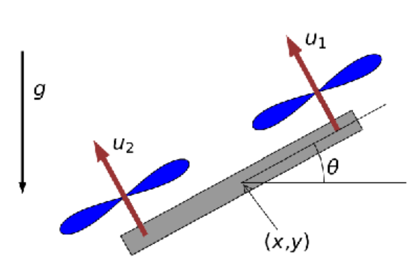

# Quadrotor Control with Reinforcement Learning

[](https://www.python.org/downloads/)
[](https://stable-baselines3.readthedocs.io/)
[](https://gymnasium.farama.org/)

A sophisticated implementation of autonomous 2D quadrotor control using Deep Reinforcement Learning. This project demonstrates how to train a quadrotor to navigate to target positions while avoiding obstacles using Proximal Policy Optimization (PPO).



## 🚀 Features

- Custom Gymnasium environment for 2D quadrotor simulation
- Reinforcement learning implementation using Stable-Baselines3
- Advanced reward shaping for obstacle avoidance and target reaching
- Gravity compensation for improved stability
- Comprehensive state space and action space handling
- Collision detection and boundary management
- Configurable hyperparameters for PPO training


## 🔧 Installation

1. Clone the repository:
```bash
git clone https://github.com/yourusername/quadrotor-control.git
cd quadrotor-control
```

2. Create a virtual environment and activate it:
```bash
python -m venv venv
source venv/bin/activate  # On Windows: venv\Scripts\activate
```

3. Install dependencies:
```bash
pip install -r requirements.txt
```

## 💻 Usage

### Training

To train the quadrotor control policy:

```bash
Run the jupyter notebook 
```

The script implements PPO with the following key hyperparameters:
- Learning rate: 9e-3
- Batch size: 32
- Training steps: 600,000
- Entropy coefficient: 1e-2


## 🛠️ Technical Details

### Environment Design

The custom Gymnasium environment (`QuadrotorEnv`) implements:

1. **State Space**: 6-dimensional continuous space representing:
   - Position (px, py)
   - Linear velocities (vx, vy)
   - Orientation (θ)
   - Angular velocity (ω)

2. **Action Space**: 2-dimensional continuous space for rotor forces (u1, u2)

3. **Reward Function**: Multi-component reward including:
   - Target reaching incentive using exponential reward
   - Obstacle avoidance penalty
   - Boundary violation penalty
   - Control effort penalty

### System Dynamics

The quadrotor follows these equations of motion:

```math
\dot{p_x} = v_x
m \dot{v}_x = -(u_1 + u_2) \sin \theta
\dot{p_y} = v_y
m \dot{v}_y = (u_1 + u_2) \cos \theta - mg
\dot{\theta} = \omega
I \dot{\omega} = r(u_1 - u_2)
```

## 📈 Results

The trained policy successfully:
- Reaches target positions with high accuracy
- Avoids obstacles effectively
- Maintains stable flight through gravity compensation
- Converges within 600,000 training steps

## 🤝 Contributing

Contributions are welcome! Please feel free to submit a Pull Request. For major changes, please open an issue first to discuss what you would like to change.

## 📝 License

This project is licensed under the MIT License - see the [LICENSE](LICENSE) file for details.

## 🔗 Citation

If you use this code in your research, please cite:


## Acknowledgments

- [Stable-Baselines3](https://github.com/DLR-RM/stable-baselines3) for the RL framework
- [Gymnasium](https://gymnasium.farama.org/) for the environment structure
- To professor Ludovic Righetti and TA Armand Jordana at NYU 
